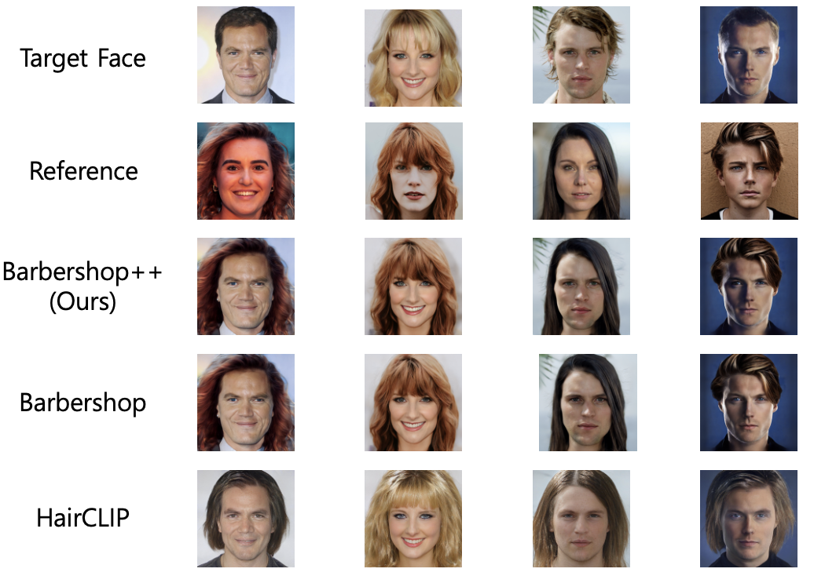

# Barbershop++

## Authors
- Bohgyu Kim, Kyongmo Kim, Nayoung U, DongBin Na
- Konkuk Univ, KAIST Univ, Ajou Univ, POSTECH

## Abstract
> Recently, virtual hair styling service using deep learning technology is attracting attention. The core of virtual hair styling technology is ① to change the hairstyle naturally while maintaining the identity of the person, and ② to return the results quickly enough to satisfy the service users. However, existing deep learning-based methods have a problem in that they change not only the hairstyle but also the facial features that indicate the identity of the face, or that inference takes a long time. In this paper, we propose Barbershop++, a method that applies an encoding network to the core components of the existing Barbershop method. Barbershop++ speeds traditional reasoning while maintaining image quality with virtual hair styling.
Reduced by 1/3 for improvement. In particular, this paper is expected to be a cornerstone of the deep learning-based virtual hair styling industry/research field in the future in that it can generate natural images even from Korean facial images.

### Source Codes

* [HairCLIP](./HairCLIP-inference.ipynb)
* [Barbershop](./Barbershop_inference.ipynb)
* [Barbershop++ (Ours)](./Babershop%2B%2B-inference.ipynb)


## Quality of the virtual hairstyling generation model


## Average inference time of virtual hairstyling generation model (sec)
|HairCLIP|Barbershop|Barbershop++ (Ours)|
|---:|---:|---:|
|11.4|864.75|278.86|


## Prerequisite
- Prepare 2 images (Target, Reference)
    - Please put the **target image** in the form of `Barbershop/unprocessed/input_img.jpg`.
    - Please put the **reference image** in the form of `Barbershop/unprocessed/ref_img.jpg`.


## Download II2S images
Please download the [II2S](https://drive.google.com/drive/folders/15jsR9yy_pfDHiS9aE3HcYDgwtBbAneId?usp=sharing) 
and put them in the `Barbershop/input/face` folder.

## Inference
Please check the `./Barbershop++-inference.ipynb` file in this repository.

After encoding pSp, save `.npy` file in `Barbershop/output/W+` folder

```shell
# Align the face of the file in the unprocessed folder, and automatically create an image in the input/face folder
!python align_face.py
```

```shell
# inference script example
!python main.py --im_path1 input_img2.png --im_path2 117.png --im_path3 117.png --sign realistic --smooth 1
```

